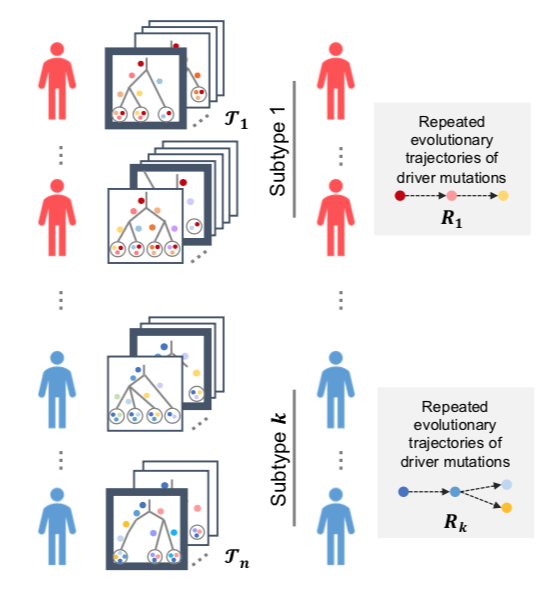

# RECAP: Detecting Evolutionary Patterns of Cancers using Consensus Trees

RECAP is an iterative, heuristic algorithm for solving the Multiple Choice Consensus Tree (MCCT) problem. The input is a family of sets of patient tumor phylogenies and an integer k > 0. RECAP then returns (i) a single expanded tumor phylogeny for each patient, (ii) an assignment of patients into k clusters, and (iii) a consensus tree for each cluster summarizing its repeated evolutionary patterns.  

<p align="center">
  
</p>

RECAP can be run over a range of values for the number of clusters, k, and then a model selection criterion, such as the elbow method or Bayesian Information Criterion, can be used to select a particular k. 

## Contents

  1. [Getting started](#start)
     * [Dependencies](#dep)
     * [Compiling code](#build)
  2. [Usage instructions](#usage)
     * [I/O formats](#io)
     * [RECAP Executable](#recaprun)
       * [Running RECAP](#recaprun)
       * [RECAP output](#recapout)
     * [Analyze Executable](#analyze)
       * [Running Analyze](#analyzerun)
       * [Analyze output](#analyzeout)

<a name="start"></a>

## Getting started

RECAP is written in C++11. The repository is organized as follows:

| Folder    | Description                                                  |
| --------- | ------------------------------------------------------------ |
| `src`     | source code for RECAP                                        |
| `data`    | input data for RECAP                                         |
| `results` | output from RECAP and example Python code to perform model selection |

<a name="dep"></a>

### Dependencies   

RECAP can be compiled with [CMake](https://cmake.org/) (>= 2.8) and has the following dependencies:

* [Boost](https://www.boost.org/) (>= 1.69.0)
* [Lemon](https://lemon.cs.elte.hu/trac/lemon) (>= 1.3.1)

<a name="build"></a>

### Compiling code

Here we walk through how to build the executables using CMake. First, navigate to a directory in which you would like to download RECAP. Then perform the following steps: 

```bash
# Download repository
git clone https://github.com/elkebir-group/RECAP.git

# Enter downloaded RECAP folder
cd RECAP/

# Make new build directory and enter it
mkdir build
cd ./build/

# Use cmake to compile executables. 
# OPTIONAL: specify lemon and/or Boost paths if not detected automatically.
cmake .. -DLIBLEMON_ROOT=/usr/local/ -DBOOST_ROOT=/scratch/software/boost_1_69_0/
make
```

<a name="usage"></a>

## Usage instructions

Here we describe how to run the RECAP executables. 

<a name="io"></a>

### I/O format

RECAP takes as input a file containing a cohort of patient trees formatted according to a specific convention. An example of such a file can be found in the data folder [here](./data/TRACERx_lung/tracerx_lung.txt). 

Note that **all patient trees must have the same root node**. The label used in this example is "GL", but this must be indicated on input to RECAP. 

Also, **mutation cluster labels should separate mutations with a consistent symbol**. The default is a semicolon ";" but this can be changed on input to RECAP. 

Finally, all **text following the pound symbol on each line will be ignored** by RECAP so it can be annotated in way that is useful to the user.      

The first line of the file should give the number of patients in the file.

```tex
99 # patients
```

On the second line, we indicate the number of trees for the first patient. 

```tex
3 #trees for CRUK0001
```

On the third line, we indicate the number of edges in the first tree for the first patient. 

```tex
4 #edges
```

The following lines each contain one directed edge from this first tree. The two node labels should be separated by a space. The first label is the source and the second label is the target for the directed edge. In this example, some of the node labels correspond to mutations clusters comprised of several mutations separated by a semicolon. 

```tex
GL TP53;MGA;WRN;EGFR
PASK ARHGAP35
TP53;MGA;WRN;EGFR PASK
ARHGAP35 NF1
```

The remaining trees for the first patient are indicated in a similar manner on the subsequent lines. 

```tex
4 #edges
GL TP53;MGA;WRN;EGFR
PASK ARHGAP35
TP53;MGA;WRN;EGFR NF1
NF1 PASK
4 #edges
GL TP53;MGA;WRN;EGFR
PASK ARHGAP35
PASK NF1
TP53;MGA;WRN;EGFR PASK
```

This format then repeats for the remaining 98 patients.  

```tex
1 #trees for CRUK0003
2 #edges
GL PIK3CA;EGFR;CDKN2A
PIK3CA;EGFR;CDKN2A CTNNB1
1 #trees for CRUK0004
2 #edges
GL TP53;EGFR
TP53;EGFR SMAD4;NOTCH1
1 #trees for CRUK0005
2 #edges
GL CMTR2;TP53;BRAF;PASK;TERT
CMTR2;TP53;BRAF;PASK;TERT NRAS
3 #trees for CRUK0006
3 #edges
GL PLXNB2;TP53;KEAP1;TERT
FANCC MAP3K1
PLXNB2;TP53;KEAP1;TERT FANCC
3 #edges
GL PLXNB2;TP53;KEAP1;TERT
MAP3K1 FANCC
PLXNB2;TP53;KEAP1;TERT MAP3K1
3 #edges
GL PLXNB2;TP53;KEAP1;TERT
PLXNB2;TP53;KEAP1;TERT FANCC
PLXNB2;TP53;KEAP1;TERT MAP3K1
.
.
.
1 #trees for CRUK0099
1 #edges
GL STK11;KEAP1;TP53
```

<a name="recap"></a>

### RECAP Executable

<a name="recaprun"></a>

#### Running RECAP

This executable requires as input a filepath to the file of patient trees as described above. There are also several flags that must be set. The flag `-k`  should be followed with the number of desired clusters. The flag `-p` should be followed with a unique path for the output files. The flag `-R` should be followed with the label of the root node shared by all patient trees.   

```bash
# An example of the minimum input information needed to run RECAP
./build/recap -k 3 -p "./results/k3" -R "GL" "./data/TRACERx_lung/tracerx_lung.txt"
```

There are additional input options that can be specified.

`-r` allows the user to specify the number of restarts (default: 50). 

`-t` specifies a time limit in seconds as the stopping criterion (default: -1, no time limit). 

`-s` specifies a seed for the random number generator (default: 0). 

`-S` specifies the the separator used between mutations in a mutation cluster label (default: ;).  

`-c` specifies the minimum number of patients that must have a mutation for it to be included in the analysis. All mutations falling below this threshold are removed from the patient input trees (default: 1).  

These options can also be viewed by typing `./build/recap --help`.  

<a name="recapout"></a>

#### RECAP output

This executable outputs three different file types. Note that `${PREFIX}` is the filepath specified by `-p`.  

**Dot file** For each cluster i, a `${PREFIX}_cluster${i}.dot` file is generated. This gives the final parent-child consensus graph for this cluster. Edges included in the consensus tree are indicated in red. Each edge is weighted by the number of patients assigned to this cluster that contain that particular edge.   

```bash
# Example of how to convert dot file to PDF 
dot -Tpdf k7_r500_c100_cluster0.dot -o k7_r500_c100_cluster0.pdf
```

**Summary file** Next, a `${PREFIX}_summary.tsv` file is generated (see [here](./results/TRACERx_lung/k10_summary.tsv)) for an example). `method` gives something of the form 'CA-r#-t#', where CA indicated coordinate ascent, the number following r is the number of restarts (i.e., `-r`), and the number following t is the maximum time limit in seconds (i.e., `-t`). `time` gives the total time in seconds that the instance took to run. `k` gives the number of clusters specified in this instance (i.e., `-k`). `cost` is the total parent-child distance from the selected, expanded patient trees to the corresponding consensus trees. `cost-i` is the total  parent-child distance from the selected, expanded patient trees for cluster i to the consensus tree for cluster i. `trees` is the total number of selected trees, which is equal to the number of patients in the cohort. `trees-i` is the number of patients assigned to cluster i.  

**Solution file** Finally, a `${PREFIX}_solution.txt` file is generated (see [here](./results/TRACERx_lung/k10.solution.txt)) for an example). The first line of the file gives the number of clusters in the solution. This should match the speficied `-k`. 

```tex
2 # clusters
```

The consensus tree for each cluster is then specified. The distance is the total parent-child distance between the selected, expanded trees and the consensus tree for this cluster. The number following each edge is the weight in the normalized parent-child graph.  

```tex
9 # edges in consensus tree 1, distance 7.88889
GL TP53 2.7
GL dummy 2.7
dummy CDKN2A 2.25
dummy EGFR 2.1
dummy KEAP1 2.4
dummy KRAS 2.2
dummy PIK3CA 1.95
dummy SOX2 2.1
dummy TERT 2.35
```

After all consensus trees are reported, there is a line specifying the total number of patients. 

```tex
99 # patients
```

The cluster assignment as well as the selected, expanded tree is then reported for each patient.

```tex
1 # cluster index for patient 0, distance 0.111111
0 # selected input tree index for patient 0
9 # edges in selected input tree for patient 0
dummy TERT
dummy SOX2
dummy PIK3CA
dummy KRAS
dummy KEAP1
dummy CDKN2A
TP53 EGFR
GL dummy
GL TP53
```

<a name="analyze"></a>

### Analyze Executable

<a name="analyzerun"></a>

#### Running Analyze

This executable takes as input the solution.txt file produced as output of RECAP. It also takes as input the original input file to RECAP described above in [I/O formats](#io). `-H` is an optional flag that indicates the column labels should be printed in the output.  

```bash
# Run analyze command on real data. 
./build/analyze "./results/TRACERx_lung/k3.solution.txt" \
-i "./data/TRACERx_lung/tracerx_lung.txt"
```

If the input instance was over simulated data, it is also possible to compare the output of RECAP to ground truth. This requires indicating a ground truth solution file using `-s`. The format of this file is the same as the solution.txt file produced as output of RECAP (see [here](./data/simulations/M5_m5/simulations_solution/s0_k1_n100_M5_m5_simulations.txt) for example).

```bash
# Run analyze command on simulated data. 
./build/analyze "./results/simulations/RECAP/M5_m5/s0_k1_n100_M5_m5.solution.txt" \
-s "./data/simulations/M5_m5/simulations_solution/s0_k1_n100_M5_m5_simulations.txt" \
-i "./data/simulations/M5_m5/simulations_input/s0_k1_n100_M5_m5_simulations.txt"
```

In practice, it is often helpful to loop over all k values run for the input instance. This can be done with a bash script similar to the following:

```bash
#!/bin/bash
first=true 
for k in {1..15}
do
    f=./results/k${k}.solution.txt
    if [ "$first" = true ]
    then
        first=false
        ./build/analyze -H $f -i "./data/TRACERx_lung/tracerx_lung.txt"
    else
        ./build/analyze $f -i "./data/TRACERx_lung/tracerx_lung.txt"
    fi
done
```

The output of analyze can be saved to a file by redirecting it  `AnalyzeCommand > results.tsv `. 

<a name="analyzeout"></a>

#### Analyze output

An example of output from the Analyze executable can be found in the results folder [here](./results/TRACERx_lung/results.tsv). 

The fields `min_trees`, `median_trees`, and `max_trees` give the minimum, median, and maximum number of trees per patient in the input files, respectively. `total_trees` gives the total number of trees across all patients in the input file. `PC_dist` is the total parent-child distance between each selected, expanded patient tree and the corresponding consensus (i.e., the criterion score). Finally, `patients` is the number of patients in the cohort, and `inferred_k` is the number of clusters k used for this instance.  

When run with a ground truth file specified (i.e., with `-s`), additional fields are output. `true_k` gives the actual number of clusters in the ground truth file. `consensus_PC` gives the total parent-child distance between the ground truth consensus trees and those found by RECAP. Deciding how to pair the consensus trees for comparison is done via a maximum weighted perfect matching algorithm. `selected_PC` gives the total parent-child distance between the ground truth patient trees and those selected by RECAP. `clustering_recall`, `clustering_precision`, and `clustering_Rand` give the precision, recall, and [Rand index](https://en.wikipedia.org/wiki/Rand_index) for the clustering found by RECAP as compared to ground truth, respectively. `selection_accuracy` gives the fraction of patient trees selected by RECAP that exactly match the ground truth tree. Finally, `sol_PC_dist` gives the total parent-child distance between selected trees and consensus trees in the ground truth file.
